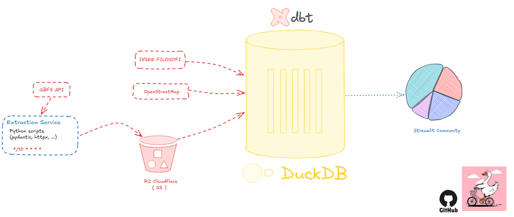

  

# 🚲 DuckBike

**An independent mobility audit of Dott's Paris bike-share fleet, reconstructed from raw GBFS data.**

DuckDB + dbt over Cloudflare R2, scheduled on GitHub Actions, served as a Streamlit dashboard.

### 👉 [**Live dashboard**](https://duck-bike.streamlit.app/)

---

## The problem

The public [GBFS](https://gbfs.org/) feed only tells you **where the available bikes are right now** — a stateless snapshot. No trips, no demand, no coverage. And Dott **rotates bike IDs between snapshots**, so you can't even follow one bike over time. DuckBike turns that stream of anonymous dots into the answers below.
## Questions it answers

| Tab | Question |
|-----|----------|
| **Fleet Quality** | How much of the "available" fleet is real vs *theatrical* — out of zone or too low on battery to ride? |
| **Coverage Over Time** | What share of the (demand-weighted) population is within a short walk of a usable bike? |
| **Coverage Gaps** | *Where* and *when* are the persistent gaps? |
| **Origin & Destination** | Where do bikes accumulate and drain over the day? |
| **Street Usage** | Which streets carry the most reconstructed trip load? |

## Architecture

Three services, glued by R2 object storage:

| Service | What it does |
|---------|--------------|
| **Extraction** | Python scripts poll the GBFS feed (~every 10 min via GitHub Actions) and land raw Parquet snapshots in Cloudflare R2. |
| **Transform** | dbt + DuckDB read the raw lake (plus OpenStreetMap & INSEE Filosofi census) and build `staging → intermediate → marts`. |
| **Serving** | A Streamlit dashboard queries a slim, marts-only DuckDB published back to R2. |

## Transformations

Raw snapshots are thin (id, lat/lon, battery, timestamp). The transform layer enriches every observation with the dimensions the questions need:

- **`h3_index`** — the [H3](https://h3geo.org/) cell (res 9), computed at ingestion, used to aggregate everything spatially.
- **`is_in_zone`** — point-in-polygon test against the operator's geofence.
- **`is_trip_viable`** — battery ≥ 20% (a bike too low to ride isn't real supply).
- **`is_stale`** — hardware last reported > 1h ago.
- **`hour_paris` / `is_weekend`** — local-time dimensions for time-of-day and weekday/weekend splits.

It then rolls observations into **sessions** (a rotating ID's first/last sighting + battery at each end), and joins **walk-time** (OSM) and **residential demand** (Filosofi, age-weighted) to measure coverage.

## Matching trips

This is the analytical core — recovering trips no feed ever records.

A rented bike *disappears* at A; later a new ID *appears* at B. We frame trip recovery as a **minimum-cost matching** between session-ends (origins) and session-starts (destinations):

1. **Candidates** — pair every origin with every destination that appears soon after, nearby, with a *plausible battery drop* (a ride drains battery roughly in proportion to distance).
2. **Cost** — score each pair by how well the battery drop matches the distance, plus small penalties for time and distance. Lower cost = more likely the same bike.
3. **Match** — sort all candidate pairs by cost and greedily assign each origin/destination at most once. Pairs above a cutoff cost are rejected: those origins were **operator pickups** (rebalancing/charging), not user trips.
4. **Route** — snap matched trips to the OpenStreetMap bike network and accumulate per-street usage.

**It's an inference, not ground truth** — ID rotation means we never observe real trips, so the dashboard is built to be read at the **aggregate** level (where demand concentrates, which streets carry load), not trip-by-trip.

---

## Questions?

Got a question, spotted something off, or want to talk through the approach? Reach out, happy to dig in.

Independent analysis using public open data (Dott GBFS · OpenStreetMap · INSEE Filosofi).

